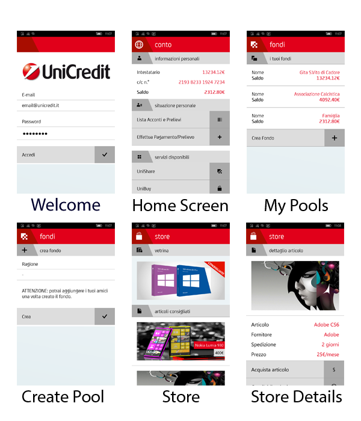

# Unicredit Appathon 2014

This is a Windows Phone 8.1 RT app presented at Unicredit Appathon 2014, an hackathon organized by Unicredit Italy.
The app has to be consider at the level of a functional mockup, and features two main sections:

* UniShare: useful for when you are organizing something with your friends and you need a common economic pool from which everyone can whitdraw.
* UniBuy: an Unicredit in-app store, customized according to the user overall purchases.

The app is fully localized in Italian.

Below here, a series of screenshots that show the content of the app:

